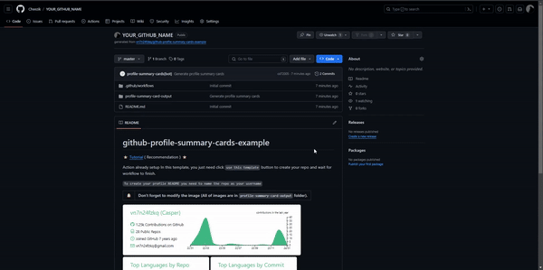

# Let's get started!
This tutorial will help you deploy Github-profile-summary-cards with ease. </br>
 If you have any issues regarding the gifs, you can find high res video verions [Here.](https://github.com/vn7n24fzkq/github-profile-summary-cards/wiki/Videos)

### Table of Contents
1. [Generate token](#generate-token)
2. [Select a repo](#select-a-repo)

   - [Create a new repo](#new-repo)
    - [Add to existing repo (Recommended ⭐)](#existing-repo)
3. [Create a workflow](#create-a-workflow)
    - [Additional information](#additional-information)
4. [Edit workflow file](#edit-workflow-file)
5. [Run the workflow](#run-the-workflow)
6. [Final Step](#final-step)
7. [The end](#the-end)


# Generate token 

1. Navigate to your profile's Settings -> Developer setting -> Personal access tokens -> Generate new token


2. Name your token
(I'd recommend naming it something after `profile-summary-cards-token`) and ticking these boxes:


<p align="center">  </p>

3. And copy your token (**and don't lose it! You'd have to generate a new token**)


<!--
repo
-  repo:status
-  repo_deployment
-  public_repo
user
-  read:user
-  user:email
-->

# Select a repo

- If you want to add to an already EXISTING repository.  [Click here](#existing-repo)
  - (E.g. If you already have a README that shows up on your profile) 
- If you want to create a brand NEW repository. [Click here](#new-repo)


### New repo
To Create a new repo from a template:
1. Go to [Template link](https://github.com/vn7n24fzkq/github-profile-summary-cards-example)
2. Click on the "Use this template" button in the top right corner
3. Select "Create a new template" 

<p align="center">  </p>

4. Name the repo as your username <br> (E.g. `FunnyUsername/FunnyUsername`, this popup should appear if you've done it correctly)
<p align="left">  </p>
5. You can ignore the next sub-step.


### Existing repo
---
1. Add a README.md file **[if you dont have that file already]**

2. Rename your repo to your username (E.g. `FunnyUsername/FunnyUsername`) **[if you havent already]** <br>
<p align="left">  </p>
3. That's pretty much all. lets continue


# Create a workflow

Now we will add a workflow to automatically update the summary cards.

1. Navigate to the repo's Actions -> New workflow -> Set up workflow yourself 
2. Name your new workflow (I'd recommend naming it something after `profile-summary-cards`)
  * **Make sure you put `.yml` at the end!**

<p align="center">  </p>

 4. **Commit changes!**

Code snippet:
  ```
name: GitHub-Profile-Summary-Cards

on:
    create:
    schedule: # execute every 24 hours
      - cron: "* */24 * * *"
    workflow_dispatch:

jobs:
  build:
    runs-on: ubuntu-latest
    name: generate-github-cards
    permissions:
      contents: write

    steps:
      - uses: actions/checkout@v2
      - uses: vn7n24fzkq/github-profile-summary-cards@release
        env:
          GITHUB_TOKEN: ${{ secrets.[YOUR_SECRET_TOKEN_NAME] }}
        with:
          USERNAME: ${{ github.repository_owner }}
```

## Additional information

>Please note that the workflow in it's current configuration will run every 24h (it will update every 24h) if you want to change it here is a ``cron's job definition``

```# .---------------- minute (0 - 59)
# |  .------------- hour (0 - 23)
# |  |  .---------- day of month (1 - 31)
# |  |  |  .------- month (1 - 12) OR jan,feb,mar,apr ...
# |  |  |  |  .---- day of week (0 - 6) (Sunday=0 or 7) OR
# |  |  |  |  |     sun,mon,tue,wed,thu,fri,sat
# |  |  |  |  |
# *  *  *  *  * 
```

So let's say you want it to run every 15 hours: <br>
`- cron: "* */15 * * *"`

Or for example you want it to run every friday at 12:35pm: <br>
`- cron: "35 12 * * fri"`

# Create a Secret for Token

1. Navigate to repo's Settings -> Secrets and variables -> Actions -> Repository secrets -> New repository secret

2. Name your secret (again, I'd suggest naming your secret as `summary_card_token` or similar) 

3. Past in your **Personal access token**. 
  - in case you've lost it. Please go back to [Generate token](#generate-token) and get a new one.

4. **Copy that New secret's name!**


<p align="center">  </p>

# Edit workflow file
Now that we have obtained the Secret, we can move on the last step before deployment 🎉

1. Navigate back to Code -> .github -> workflows -> `profile-summary-cards.yml` *(or customized name you gave to the .yml file)*

2. Hit the pencil icon on the right side of your screen

3. Edit the `[YOUR_SECRET_TOKEN_NAME]` inside the `GITHUB_TOKEN: ${{ secrets.[YOUR_SECRET_TOKEN_NAME] }}` with the Secret 

- (Result should look something like this: `GITHUB_TOKEN: ${{ secrets.SUMMARY_CARD_TOKEN }}`)

4. Commit changes


<p align="center">  </p>


# Run the workflow

1. Navigate to Actions -> on the left side `profile-summary-cards` -> hit the button `Run workflow` -> Run workflow


<p align="center">  </p>

2. Wait till the workflow run appears (if not, please refresh the site)

    - its normal that the loading indicator "gets stuck" at a certain point, just refresh the page.

3. If the loading indicators turn blue with a check inside, congratulations! 
    - if it for some reason wont, you've probably messed up somewhere (or this tutorial got outdated!) I recommend going from the beginning again OR making a new repo and renaming it after you've successfully managed to deploy this app.

# Final step    
You did it! now we are ready to choose the theme we want our cards to be in
1. Navigate to Code -> profile-summary-card-output -> Select a prefered theme -> README.md

   -  You can get really creative with the layout you want your cards to be in, but for simplicity sake, I will pick a whole bundle

2. Copy the desired markdown section.

3. Navigate to Code -> Hit on pencil button on the right side of your README.md file

4. Paste in the copied content and hit Commit changes!


<p align="center">  </p>

# The end

Now if everything went right. The cards should appear on your profile!

Don't be afraid to experiment with themes! There are many that might suit you better.

---
That's it is guys. Thank you for going through this tutorial. I hope you found it somewhat helpful.

if you find any typos or erros please open an issue so I can get on them asap.

Have a pleasant rest of your day ^^
